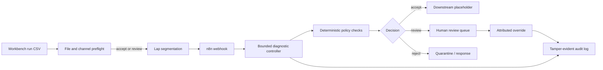

# Motorsport Telemetry Quality Agent

An auditable, bounded n8n agent that turns a completed motorsport session into a structured telemetry-quality decision. It removes the repetitive validation gap without giving automation authority beyond an explicit policy.

This repository contains the completed Milestones 1 and 2 plus a thin end-to-end prototype for **Motorsport Workbench Part 4**. It is evidence of the architecture and responsible-automation approach, not a claim that the later sensor and context milestones are production-ready.

## What works now

- Accepts a canonical lap as JSON through an n8n webhook.
- Preflights complete Workbench run files before any lap enters n8n.
- Runs deterministic schema, timing, missing-data, unit, physical-range, frozen-signal, derivative, and basic cross-channel checks.
- Estimates `out_lap`, `in_lap`, `push_lap`, or `installation_lap` context.
- Produces one structured `accept`, `review`, or `reject` decision.
- Allows only `accept` to reach the downstream-processing placeholder.
- Records evaluations and attributed human overrides in a tamper-evident JSONL hash chain.
- Retains successful and failed n8n executions for end-to-end traceability.
- Includes clean and deliberately corrupted telemetry fixtures plus automated tests.

## Architecture



The controller may select additional diagnostics, but its action vocabulary is fixed to `accept`, `reject`, and `request_human_review`. It cannot change policy, repair data silently, or execute downstream work after `review` or `reject`.

## Run locally

Prerequisites: Node.js 20.19–24 and npm. Node 24 is pinned in [.nvmrc](./.nvmrc).

```bash
nvm install
nvm use
npm install
```

Start the deterministic telemetry service in terminal one:

```bash
npm run agent
```

Import the workflow once, then start n8n in terminal two:

```bash
npm run n8n:import
npm run n8n:publish
npm run n8n:start
```

Open [http://localhost:5678](http://localhost:5678), open **Telemetry Quality Agent - Milestone 2**, and activate it. Submit the clean example:

```bash
curl --fail-with-body \
  --header 'Content-Type: application/json' \
  --data @samples/clean-push-lap.json \
  http://localhost:5678/webhook/telemetry/validate
```

The corrupted fixture returns HTTP 422 and a structured rejection:

```bash
curl --header 'Content-Type: application/json' \
  --data @samples/corrupted-lap.json \
  http://localhost:5678/webhook/telemetry/validate
```

## Ingest the copied Motorsport Workbench manifests

The existing Workbench manifest collection has been copied locally to `data/incoming-manifests/`; that large-data directory is intentionally ignored by Git. Run the complete file/channel preflight first:

```bash
npm run preflight -- data/incoming-manifests --output .local/preflight-report.json
```

Then prepare two laps without submitting:

```bash
npm run ingest -- data/incoming-manifests --dry-run --limit 2
```

Then, while the telemetry service and n8n are running, submit one real lap:

```bash
npm run ingest -- data/incoming-manifests --limit 1
```

The adapter discovers `motorsport-ml/run-manifest` v1.1 event folders, honors each run's `include` flag, verifies the run CSV SHA-256, splits on `PDS Lap Number (-)`, maps the 100 Hz channels, and submits laps sequentially. See [docs/WORKBENCH_INGESTION.md](./docs/WORKBENCH_INGESTION.md) for the exact mapping and full-collection command.

The n8n package and its local state stay out of Git: `node_modules/` and `.local/` are ignored. The version is pinned in `package.json` and locked in `package-lock.json`, so a clone can reproduce the installation.

## Use the validator without n8n

```bash
npm run validate -- samples/clean-push-lap.json --no-audit
npm run validate -- samples/corrupted-lap.json --no-audit
```

Start the service and inspect its endpoints:

| Endpoint         | Purpose                                                  |
| ---------------- | -------------------------------------------------------- |
| `GET /health`    | Service and active-policy identity                       |
| `POST /validate` | Validate one canonical lap and record the result         |
| `POST /override` | Record an attributed human `accept` or `reject` override |
| `GET /audit`     | Return events plus hash-chain verification               |

An override never edits the original decision. It appends a new event requiring `run_id`, `reviewer`, `decision`, and `reason`:

```bash
curl --request POST http://127.0.0.1:3100/override \
  --header 'Content-Type: application/json' \
  --data '{
    "run_id": "RUN_ID_FROM_VALIDATION",
    "decision": "accept",
    "reviewer": "engineer@example.com",
    "reason": "Known logger substitution; approved for this analysis only."
  }'
```

## Test

```bash
npm test
npm run test:smoke
```

The unit suite verifies decisions, hard gates, review routing, stable input fingerprints, audit-chain integrity, and the n8n guardrail topology. The smoke test starts the HTTP service, evaluates both fixtures, records an override, and verifies the resulting three-event chain.

## Repository map

| Path                                     | Role                                                                               |
| ---------------------------------------- | ---------------------------------------------------------------------------------- |
| `workflows/telemetry-quality-agent.json` | Importable n8n orchestration workflow                                              |
| `config/policy.json`                     | Human-owned schema, ranges, thresholds, and hard gates                             |
| `schemas/telemetry-lap.schema.json`      | Portable JSON Schema for the canonical lap contract                                |
| `src/validator.js`                       | Deterministic diagnostics and decision controller                                  |
| `src/server.js`                          | Local validation, override, and audit API                                          |
| `src/workbench-ingest.js`                | Workbench manifest discovery, hash verification, CSV mapping, and lap segmentation |
| `src/file-validation.js`                 | Full-run schema, timestamp, sample-rate, missingness, and dropout preflight          |
| `src/audit-log.js`                       | Append-only SHA-256 event chain                                                    |
| `samples/`                               | Clean and corrupted example laps                                                   |
| `test/`                                  | Decision, audit, and workflow tests                                                |
| `docs/`                                  | Architecture decisions and milestone gates                                         |
| `evidence/`                              | Sanitized milestone results from the ignored local telemetry copy                   |

## Deliberate limitations

- The fixtures are synthetic and short; thresholds are placeholders awaiting logger- and vehicle-specific evidence.
- Lap classification is heuristic, not a trained classifier.
- The JSONL audit chain makes edits detectable but is not a multi-user transactional datastore.
- No LLM is in the decision path. A later language-model layer may summarize evidence or choose from allow-listed diagnostics, but deterministic policy retains decision authority.
- Authentication, role-based access, a review dashboard, telemetry-file ingestion, and production deployment belong to later milestones.
- The pinned n8n dependency currently brings npm audit advisories through its large integration tree. Keep this instance loopback-only, do not add secrets, and review or containerize dependencies before any deployment.

See [docs/MILESTONES.md](./docs/MILESTONES.md) for the pause gates and [docs/ARCHITECTURE.md](./docs/ARCHITECTURE.md) for the design rationale.

## License

MIT
