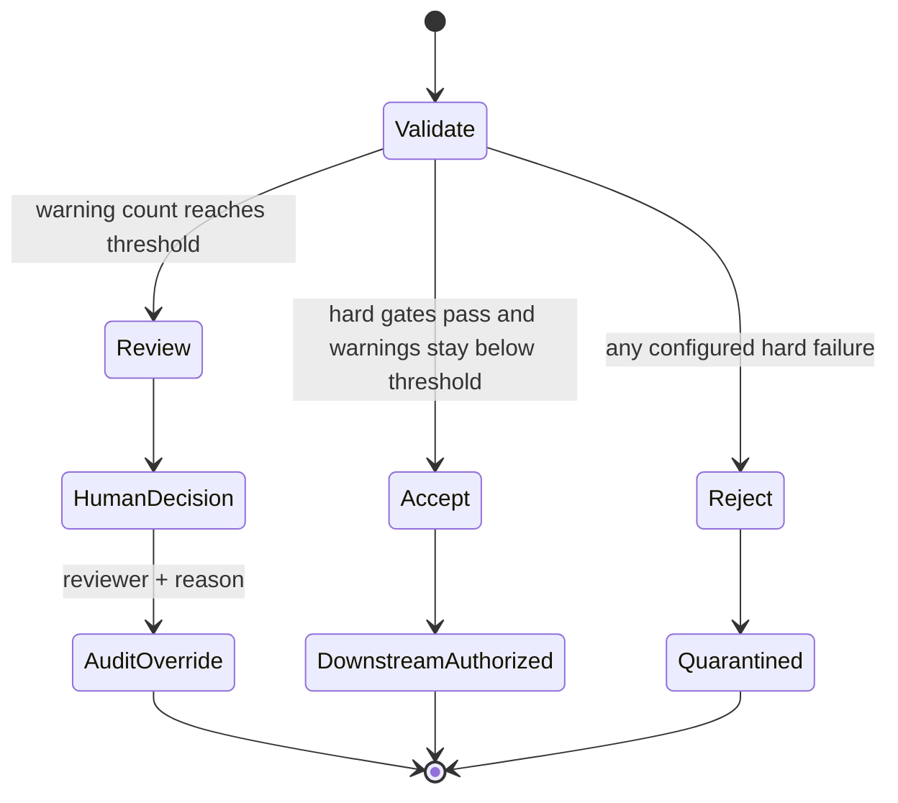

# Architecture and responsible-autonomy notes

## Decision boundary

The system separates orchestration from decision evidence:

1. The ingestion adapter verifies the Workbench manifest and source-file SHA-256.
2. A streaming full-run preflight checks schema, timestamps, sampling, missingness, and dropout intervals.
3. Rejected files stop before lap segmentation; review-level files mark every derived lap for review.
4. Accepted or review-level files are segmented into canonical schema v1.0 laps.
5. n8n receives each lap and records the workflow execution.
6. The telemetry service loads a versioned, human-owned policy.
7. The controller runs baseline checks and selects allow-listed follow-up diagnostics when evidence warrants them.
8. Deterministic gates produce `accept`, `review`, or `reject`.
9. n8n permits only `accept` to reach the downstream placeholder.
10. The service appends the decision to a hash-linked audit log.

This is agentic in the bounded sense: the controller interprets check outcomes, selects further investigations, classifies context, and chooses an allowed next state. It does not invent checks, alter thresholds, rewrite data, or broaden its own permissions.

## Decision policy

File hard failures include missing or duplicate columns, malformed row widths, timestamp duplicates or resets, missing timestamps, and excessive channel missingness. File-level timestamp gaps, sample-rate deviation, and long sparse dropouts request review. Lap hard failures include unsupported schema or purpose, rejected file provenance, too few samples, excessive missing channel data, unit mismatch, non-monotonic timestamps, and physical-range violations. Thresholds are explicit in `config/policy.json`.

## Audit model

Every event contains:

- a monotonically increasing sequence;
- the prior event hash;
- event type, timestamp, run identifier, and actor;
- the complete structured decision or override details;
- a SHA-256 hash of the canonical event content.

Changing or removing an earlier event breaks verification. For a multi-user deployment this should move to Postgres with transactions, identity-backed reviewers, immutable retention, and separate access-control logs.

Full file-preflight reports are content-addressed under `.local/file-validation/`. Each lap audit stores the report SHA-256 and a compact summary, allowing the detailed evidence to be recovered without repeating it for every lap.

## Why the LLM is not the quality gate

Telemetry validity is primarily numerical and policy-driven. An LLM would add value later by summarizing failed checks, proposing an allow-listed follow-up diagnostic, or turning evidence into a review note. It should not decide whether an out-of-range sensor is physically valid or silently overrule a hard failure. That boundary makes explanations repeatable and evaluation meaningful.

## Threats to validity

- Real-data evidence currently covers one copied event and vehicle/logger configuration; synthetic fixtures still provide the known-corruption cases.
- Fixed ranges can reject legitimate vehicle-specific behavior or miss plausible-looking corruption.
- Steering/yaw sign conventions must be normalized before cross-channel checks are portable.
- Mean wheel-speed difference does not yet distinguish lock-up, wheelspin, tyre-radius differences, or cornering geometry.
- Short windows can make frozen-signal detection overconfident.
- A hash chain is tamper-evident only if its trusted head is retained separately.
- Content-addressed preflight reports are local files, not immutable external retention.

These are explicit evaluation targets, not hidden assumptions.
