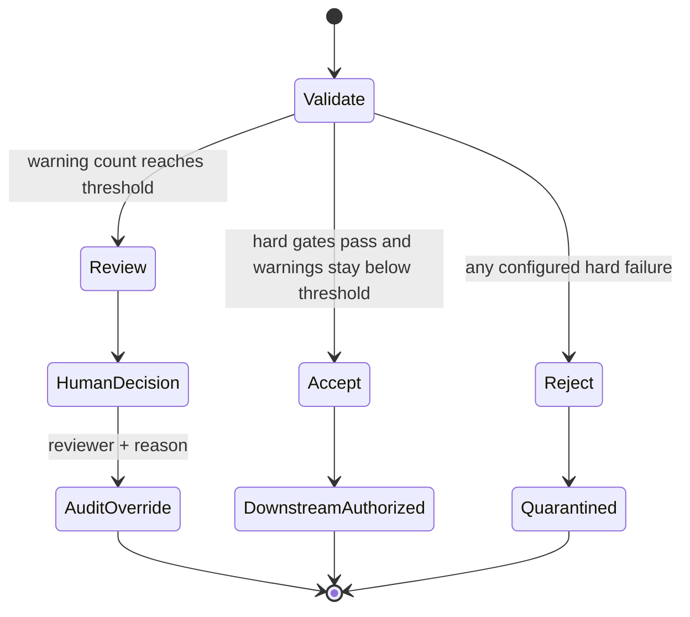

# Architecture and responsible-autonomy notes

## Decision boundary

The system separates orchestration from decision evidence:

1. n8n receives a lap and records the workflow execution.
2. The telemetry service loads a versioned, human-owned policy.
3. The controller runs baseline checks and selects allow-listed follow-up diagnostics when evidence warrants them.
4. Deterministic gates produce `accept`, `review`, or `reject`.
5. n8n permits only `accept` to reach the downstream placeholder.
6. The service appends the decision to a hash-linked audit log.

This is agentic in the bounded sense: the controller interprets check outcomes, selects further investigations, classifies context, and chooses an allowed next state. It does not invent checks, alter thresholds, rewrite data, or broaden its own permissions.

## Decision policy

The current hard failures are missing envelope fields, unsupported purpose, too few samples, excessive missing channel data, unit mismatch, non-monotonic timestamps, and physical-range violations. Warning thresholds are explicit in `config/policy.json`.

## Audit model

Every event contains:

- a monotonically increasing sequence;
- the prior event hash;
- event type, timestamp, run identifier, and actor;
- the complete structured decision or override details;
- a SHA-256 hash of the canonical event content.

Changing or removing an earlier event breaks verification. For a multi-user deployment this should move to Postgres with transactions, identity-backed reviewers, immutable retention, and separate access-control logs.

## Why the LLM is not the quality gate

Telemetry validity is primarily numerical and policy-driven. An LLM would add value later by summarizing failed checks, proposing an allow-listed follow-up diagnostic, or turning evidence into a review note. It should not decide whether an out-of-range sensor is physically valid or silently overrule a hard failure. That boundary makes explanations repeatable and evaluation meaningful.

## Threats to validity

- Synthetic examples do not represent the distributions, dropouts, conventions, and logger quirks of real sessions.
- Fixed ranges can reject legitimate vehicle-specific behavior or miss plausible-looking corruption.
- Steering/yaw sign conventions must be normalized before cross-channel checks are portable.
- Mean wheel-speed difference does not yet distinguish lock-up, wheelspin, tyre-radius differences, or cornering geometry.
- Short windows can make frozen-signal detection overconfident.
- A hash chain is tamper-evident only if its trusted head is retained separately.

These are explicit evaluation targets, not hidden assumptions.
